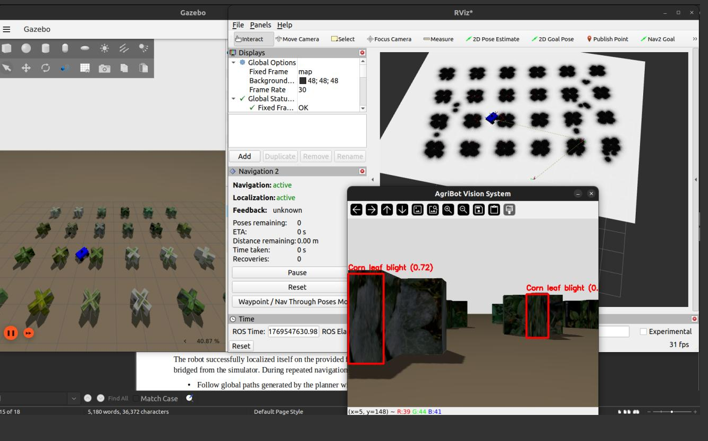

# 🤖 AgriBot

**ROS 2–Based Autonomous Crop Monitoring and Disease Detection System for Precision Agriculture in Ethiopia**

## 📌 Overview

AgriBot is a ROS 2–based autonomous mobile robot designed for precision agriculture applications. The system performs autonomous navigation in a farm environment and detects crop diseases using a deep learning–based computer vision model. The project is developed and evaluated in simulation using Gazebo and RViz, with a focus on affordability and applicability to Ethiopian agricultural contexts.

---

## 🚜 Key Features

* Autonomous navigation using **Nav2**, **SLAM** and **AMCL**
* Prebuilt map–based localization
* Reactive obstacle avoidance
* Crop disease detection using **YOLOv8**
* Real-time visualization with **RViz**
* Modular ROS 2 package structure

---

## 🧱 System Architecture

The system consists of the following ROS 2 packages:

* `agribot_description` – Robot URDF/Xacro and TF configuration
* `agribot_gazebo` – Simulation environment and world files
* `agribot_nav2_bringup` – Nav2 configuration and launch files
* `agribot_navigation` – Navigation logic and control nodes
* `agribot_vision` – Disease detection and image processing

---

## 🖥️ Requirements

### Software

* Ubuntu 22.04
* ROS 2 Humble
* Gazebo (Fortress / ROS 2 default)
* Python 3.10+

### ROS 2 Packages

Make sure the following are installed:

```bash
sudo apt update
sudo apt install -y \
  ros-humble-nav2-bringup \
  ros-humble-navigation2 \
  ros-humble-slam-toolbox \
  ros-humble-amcl \
  ros-humble-robot-localization \
  ros-humble-tf-transformations \
  ros-humble-rviz2 \
  ros-humble-gazebo-ros
```

### Python Dependencies

```bash
pip install ultralytics opencv-python numpy
```

---

## 🛠️ Build Instructions

```bash
cd agribot_ws
colcon build
source install/setup.bash
```

---

## 🚀 Running the System

### 1️⃣ Launch Simulation and Robot

```bash
ros2 launch agribot_description master.launch.py \
use_sim_time:=True \
map:=/home/<username>/agribot_ws/src/agribot_nav2_bringup/maps/my_farm_map.yaml
```
- username → your system username

---

### 2️⃣ Run Navigation Nodes

```bash
ros2 run agribot_navigation navigator_goal
ros2 run agribot_navigation reactive_avoid
```

---

### 3️⃣ RViz Navigation Interface (Optional)

To send goals using the Nav2 RViz interface:

```bash
ros2 run rviz2 rviz2
```
---

## 👁️ Disease Detection

* Vision node uses a **YOLOv8** model (`best.pt`)
* Detects crop disease classes in real time
* Detection results are visualized and logged

---

## Screenshots




---

## ⚠️ Limitations

* Evaluation conducted entirely in simulation
* Simplified terrain model compared to real Ethiopian farms
* Vision accuracy limited by dataset size, image quality, and plant representation in Gazebo
* No real-world sensor noise or hardware constraints

---

## 🔮 Future Work

* Deployment on real robotic hardware
* Improved terrain modeling and wheel slip handling
* Training vision models on locally collected datasets
* Sensor fusion for improved localization
* Performance optimization for embedded systems
